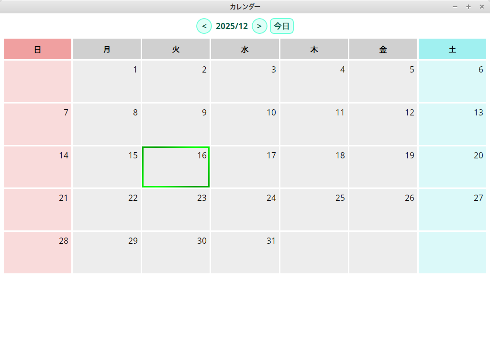

# Wails用カレンダー

  

Wails用のシンプルなカレンダーアプリケーションです。  
Avalonia版に引き続いて同じものを作ってみました。  
Wailsとは、Web技術(HTML + CSS + JavaScript) + Goを使ってクロスプラットフォームなデスクトップアプリを作れるフレームワークです。  
こちらもライセンスフリーのため、自由に使っていただいて構いません。  
